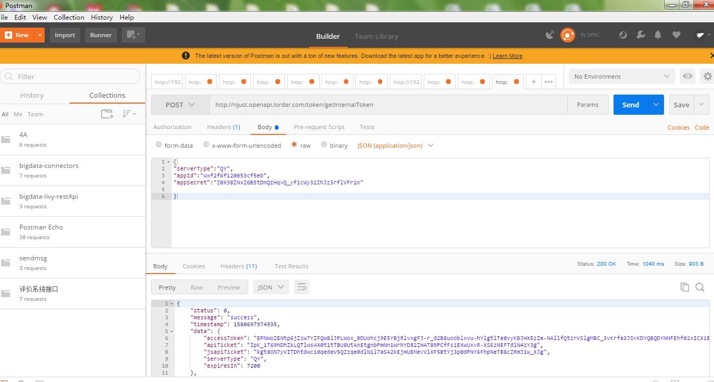

# 微信JS-SDK说明

参考文档：`https://qydev.weixin.qq.com/wiki/index.php?title=%E5%BE%AE%E4%BF%A1JS%E6%8E%A5%E5%8F%A3`

# JS-SDK使用权限签名算法
第一步:拿到的access_token 采用http POST方式请求获得jsapi_ticket



请求地址：`http://njust.openapi.lordar.com/token/getInternalToken`
 
请求参数：
```params
{
    "serverType":"QY",
    "appId":"wxf2f6f120053cf5eb",
    "appSecret":"Z0X38ZNxZGB5tDnQzHqvQ_yficWy32IhJz3rflVFr2o"
}
```
>! appSecret请勿轻易泄露，泄露后会影响应用使用

返回数据：
```return
{
    status: 0,
    message: 'success',
    timestamp: 'xxxxxxxxxxx',
    data: {
        accessToken: 'xxxxxxxxxxxxxxxxxxxxxxxxxxxxxxxxx',
        apiTicket: 'xxxxxxxxxxxxxxxxxxxxxxxxxxxxxxxxx',
        jsapiTicket: 'xxxxxxxxxxxxxxxxxxxxxxxxxxxxxxxxx',
        serviceType: 'QY',
        expiresIn: 7200
    }
}
```

第二步：生成JS-SDK权限验证的签名
参考文档：`https://qydev.weixin.qq.com/wiki/index.php?title=%E5%BE%AE%E4%BF%A1JS%E6%8E%A5%E5%8F%A3#.E9.99.84.E5.BD.951-JS-SDK.E4.BD.BF.E7.94.A8.E6.9D.83.E9.99.90.E7.AD.BE.E5.90.8D.E7.AE.97.E6.B3.95`

示例：
```demo
    noncestr=Wm3WZYTPz0wzccnW
    jsapi_ticket=sM4AOVdWfPE4DxkXGEs8VMCPGGVi4C3VM0P37wVUCFvkVAy_90u5h9nbSlYy3-Sl-HhTdfl2fzFy1AOcHKP7qg
    timestamp=1414587457
    url=http://mp.weixin.qq.com
```


### 步骤一：引入JS文件

在需要调用JS接口的页面引入如下JS文件，（支持https）：`http://res.wx.qq.com/open/js/jweixin-1.0.0.js`,代码如下：

``` js
// 方法一：引入外链js文件
<script src="http://res.wx.qq.com/open/js/jweixin-1.0.0.js"></script>

// 方法二
// 将js下载到本地，并加入到项目中，相对路径引用
<script src="static/js/wechat/jweixinHttps-1.0.0.js"></script>
```

### 步骤二：通过config接口注入权限验证配置

所有需要使用JS-SDK的页面必须先注入配置信息，否则将无法调用

!> 同一个url仅需调用一次

第一步：调用签名接口获取appId、timestamp、nonceStr以及signature

```js
// 示例示示例，签名接口请自行开发
// 参考文档：`https://qydev.weixin.qq.com/wiki/index.php?title=%E5%BE%AE%E4%BF%A1JS%E6%8E%A5%E5%8F%A3#.E9.99.84.E5.BD.951-JS-SDK.E4.BD.BF.E7.94.A8.E6.9D.83.E9.99.90.E7.AD.BE.E5.90.8D.E7.AE.97.E6.B3.95`
querySignature() {
    var url = HOST + 'signature'
    http.apiPost(url, { url: window.location.href }).then(res => {
        if (res.status == 0) {
            // 签名成功后
            var signatureParams = res.data
            this.useJsApi(signatureParams)
        }
    })
},
```

第二步：通过config接口注入权限验证配置
```js
useJsApi(signatureParams) {
    var _this = this
    parent.wx.config({
        debug: false,
        appId: 'wxf2f6f120053cf5eb', // 必填，企业号的唯一标识，此处填写企业号corpid
        timestamp: signatureParams.timestamp, // 必填，生成签名的时间戳
        nonceStr: signatureParams.nonceStr, // 必填，生成签名的随机串
        signature: signatureParams.signature, // 必填，签名，见附录1
        jsApiList: ['getLocation']// 必填，需要使用的JS接口列表，所有JS接口列表见附录2
    })
}
```

### 步骤三：通过ready接口处理成功验证

config信息验证后会执行ready方法，所有接口调用都必须在config接口获得结果之后，config是一个客户端的异步操作，所以如果需要在页面加载时就调用相关接口，则须把相关接口放在ready函数中调用来确保正确执行。对于用户触发时才调用的接口，则可以直接调用，不需要放在ready函数中。

```js
...
parent.wx.ready(function() {
    // 操作
})
...
```

### 步骤四：通过error接口处理失败验证

config信息验证失败会执行error函数，如签名过期导致验证失败，具体错误信息可以打开config的debug模式查看，也可以在返回的res参数中查看，对于SPA可以在这里更新签名。

```js
parent.wx.error(function(res) {})
```

### 步骤五：获取地理位置接口
```js
parent.wx.getLocation({
    type: 'wgs84', // 默认为wgs84的gps坐标，如果要返回直接给openLocation用的火星坐标，可传入'gcj02'
    success: function (res) {
       var latitude = res.latitude; // 纬度，浮点数，范围为90 ~ -90
       var longitude = res.longitude ; // 经度，浮点数，范围为180 ~ -180。
        var speed = res.speed; // 速度，以米/每秒计
        var accuracy = res.accuracy; // 位置精度
    }
});
```

#### 完整代码如下：

```js
// 示例示示例，签名接口请自行开发
// 参考文档：`https://qydev.weixin.qq.com/wiki/index.php?title=%E5%BE%AE%E4%BF%A1JS%E6%8E%A5%E5%8F%A3#.E9.99.84.E5.BD.951-JS-SDK.E4.BD.BF.E7.94.A8.E6.9D.83.E9.99.90.E7.AD.BE.E5.90.8D.E7.AE.97.E6.B3.95`
querySignature() {
    var url = HOST + 'signature'
    http.apiPost(url, { url: window.location.href }).then(res => {
        if (res.status == 0) {
            var signatureParams = res.data
            this.useJsApi(signatureParams)
        }
    })
},

useJsApi(signatureParams) {
    var _this = this
    parent.wx.config({
        debug: false,
        appId: 'wxf2f6f120053cf5eb', // 必填，企业号的唯一标识，此处填写企业号corpid
        timestamp: signatureParams.timestamp, // 必填，生成签名的时间戳
        nonceStr: signatureParams.nonceStr, // 必填，生成签名的随机串
        signature: signatureParams.signature, // 必填，签名，见附录1
        jsApiList: ['getLocation']// 必填，需要使用的JS接口列表，所有JS接口列表见附录2
    })
    parent.wx.error(function(res) {
        console.log(res)
    })
    parent.wx.ready(function() {
        parent.wx.getLocation({
            // 默认为wgs84的gps坐标，如果要返回直接给openLocation用的火星坐标，可传入'gcj02'
            type: 'wgs84', 
            success: function(res) {
                var latitude = res.latitude; // 纬度，浮点数，范围为90 ~ -90
                var longitude = res.longitude ; // 经度，浮点数，范围为180 ~ -180。
                var speed = res.speed; // 速度，以米/每秒计
                var accuracy = res.accuracy; // 位置精度
            }
        })
    })
}
```