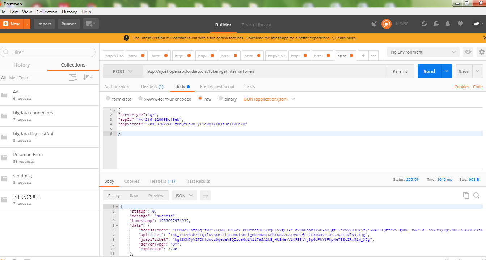

# JS-SDK使用权限签名算法
第一步:拿到的access_token 采用http POST方式请求获得jsapi_ticket



请求地址：`http://njust.openapi.lordar.com/token/getInternalToken`
 
请求参数：
```params
{
    "serverType":"QY",
    "appId":"wxf2f6f120053cf5eb",
    "appSecret":"Z0X38ZNxZGB5tDnQzHqvQ_yficWy32IhJz3rflVFr2o"
}
```
>! appSecret请勿轻易泄露，泄露后会影响应用使用

返回数据：
```return
{
    status: 0,
    message: 'success',
    timestamp: 'xxxxxxxxxxx',
    data: {
        accessToken: 'xxxxxxxxxxxxxxxxxxxxxxxxxxxxxxxxx',
        apiTicket: 'xxxxxxxxxxxxxxxxxxxxxxxxxxxxxxxxx',
        jsapiTicket: 'xxxxxxxxxxxxxxxxxxxxxxxxxxxxxxxxx',
        serviceType: 'QY',
        expiresIn: 7200
    }
}
```

第二步：生成JS-SDK权限验证的签名
参考文档：`https://qydev.weixin.qq.com/wiki/index.php?title=%E5%BE%AE%E4%BF%A1JS%E6%8E%A5%E5%8F%A3#.E9.99.84.E5.BD.951-JS-SDK.E4.BD.BF.E7.94.A8.E6.9D.83.E9.99.90.E7.AD.BE.E5.90.8D.E7.AE.97.E6.B3.95`

示例：
```demo
    noncestr=Wm3WZYTPz0wzccnW
    jsapi_ticket=sM4AOVdWfPE4DxkXGEs8VMCPGGVi4C3VM0P37wVUCFvkVAy_90u5h9nbSlYy3-Sl-HhTdfl2fzFy1AOcHKP7qg
    timestamp=1414587457
    url=http://mp.weixin.qq.com
```
